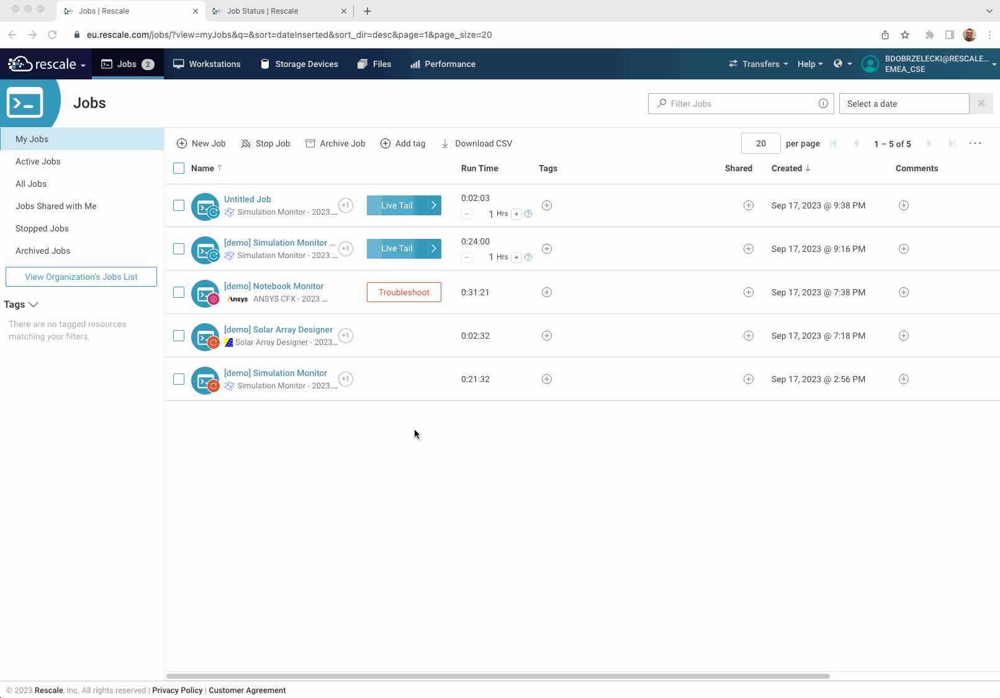

# Simulation Monitor Rescale App

Simulation Monitor is an example of a Secondary Rescale App – a web application that augments the main simulation. The job (cluster) lifecycle is defined by the main simulation process. A Secondary App starts in the background and can be used to interact with the simulation process and its outputs. Example applications include simulation progress monitoring, intermediate results visualization or on-demand check-pointing.

## How it works

The details of the technology are provided in the [Hello World Rescale App](https://github.com/rescale-labs/App_HelloWorld_Flask/) repository. The only difference here stems from the fact that the App is a secondary process that should be started, independently of the main simulation, in the background. This is achieved by starting the web server as a [daemon](https://en.wikipedia.org/wiki/Daemon_(computing)). See the last line in [spub_launch.sh](spub/spub_launch.sh-templ)

```
gunicorn --daemon --certfile $CERT --keyfile $CKEY -b 0.0.0.0:8888 app:server
```

The CFX monitoring module uses the `cfx5mondata` utility to extract data from the `mon` file. Data is then visualized in a web browser by a web application developed using the [Dash](https://dash.plotly.com/) web framework.

## Deployment

For the best user experience, publish the Simulation Monitor Rescale App using [Software Publisher](https://rescale.com/documentation/main/platform-guides/bring-your-own-software-with-rescale-software-publisher/). The procedure is identical to what was described for the [Hello World Rescale App](https://github.com/rescale-labs/App_HelloWorld_Flask/tree/main#publishing-a-rescale-app-using-the-rescale-software-publisher). See the [build.sh](spub/build.sh) for automated steps.

## Usage

Rescale Apps rely on the `jupyter4all` flag. Make sure this flag is enabled for your organization or specific Workspaces into which the App was deployed.

When specifying a Job, the Simulation Monitor application needs to be attached as the first tile (software commands are executed left to right). The application to be monitored is attached as the following tile and requires a valid command. The command executed in the context of the Simulation Monitor will return immediately (start as a daemon) and the main simulation command will be executed.

Once the cluster is started, navigate to the Job Detail page, click on the Status page and look for a Notebook URL in the Logs section. Open the URL in a new tab and start interacting with the web application.



For the CFX monitoring specifically, the user may need to wait until the simulation properly starts. The CFX module will inform the user when the `mon` file is not yet available and when the `mon` file does not yet contain usable progress information.

## Introduction to the Dash framework and development of custom monitors

> TODO: WALK THROUGH THE CODE

## What next?

Contribute! The modular design of the Simulation Monitoring application allows for independent plug-in development. If the solver you're using is currently unsupported, and you know how to extract progress data (either via a tool or by parsing output files) – copy one of the sample modules and tune it to your needs. Get in touch with us at support@rescale.com to become a contributor.

## About authors and Rescale

[Rescale™](https://rescale.com) is a technology company that builds cloud software and services that enable organizations of every size to deliver engineering and scientific breakthroughs that enrich humanity.

[Robert Bitsche](https://www.linkedin.com/in/robertbitsche/) is a Customer Success Engineer at Rescale with a background in mechanical engineering, numerical simulation, and renewable energy. Robert believes that engineering can create a better world. He also believes that the function of an expert is not to be more right than other people, but to be wrong for more sophisticated reasons.

[Bartek Dobrzelecki](https://linkedin.com/in/bardobrze) is a Customer Success Engineer at Rescale with a background in High Performance Computing and Software Engineering. He is always keen to share his knowledge, demystify technology and democratize computational thinking. He strongly believes that no technology should be indistinguishable from magic.
